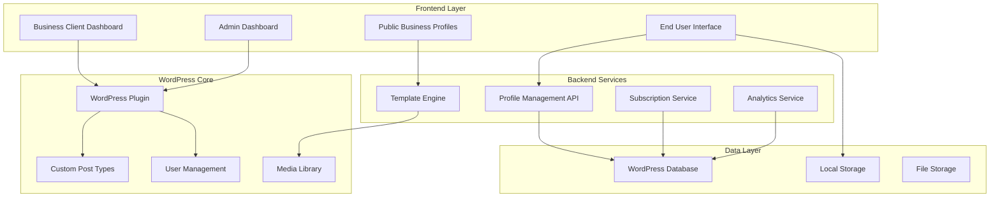

# Design Document

## Overview

The BizCard Pro Platform is a multi-tenant WordPress-based system that enables virtual business card exchange. The platform serves three distinct user personas through a comprehensive web application with subscription billing, template customization, and contact management capabilities.

**Reference Sites Analyzed:**
- https://mywebcard.co.in/bhagawati-enterprises (Primary reference for comprehensive business sections)
- https://mywebcard.co.in  
- https://digivcard.io/instruction/card/

**Design Philosophy:**
The platform will function as a comprehensive "Google Business Portal" style directory, capturing all essential business information that potential leads need. The existing vCard HTML templates serve only as reference for field types - we will create entirely new, modern layouts and designs.

**Key Design Principles:**
- Google Business Portal inspired comprehensive sections
- Modern, clean UI/UX design (not using existing vCard HTML layouts)
- Mobile-first responsive design with progressive web app capabilities
- Template-based customization system with modern design patterns
- Multi-tenant architecture with role-based access
- WordPress plugin integration for seamless administration
- Local storage with optional cloud sync for end users

## Architecture

### System Architecture



### Database Schema

**WordPress Custom Tables:**
- `wp_bizcard_profiles` - Core business profile data
- `wp_bizcard_templates` - Template assignments and customizations
- `wp_bizcard_analytics` - Visit tracking and statistics
- `wp_bizcard_subscriptions` - Billing and subscription management
- `wp_bizcard_saved_contacts` - End user saved business contacts (for registered users)

**WordPress Integration:**
- Custom Post Type: `bizcard_profile`
- Custom User Roles: `bizcard_client`, `bizcard_user`
- Custom Meta Fields for profile data
- WordPress Media Library for image management

## Components and Interfaces

### 1. WordPress Plugin Core

**Main Plugin File Structure:**
```
bizcard-pro/
├── bizcard-pro.php (Main plugin file)
├── includes/
│   ├── class-business-profile.php
│   ├── class-template-engine.php
│   ├── class-subscription-manager.php
│   └── class-analytics.php
├── admin/
│   ├── admin-dashboard.php
│   └── business-client-dashboard.php
├── public/
│   ├── profile-display.php
│   └── end-user-interface.php
├── templates/
│   ├── ceo/
│   ├── freelancer/
│   ├── restaurant/
│   └── [other template directories]
└── assets/
    ├── css/
    ├── js/
    └── images/
```

### 2. Business Client Dashboard

**Profile Management Interface:**
- Multi-step profile creation wizard
- Template selection with live preview
- Content management sections:
  - Basic Information (name, title, company, contact)
  - Services & Products with descriptions and pricing
  - Image Gallery with drag-and-drop upload
  - Social Media Links
  - Custom messaging/contact form
- Real-time preview functionality
- SEO optimization fields

**Sharing & Distribution Tools:**
- **QR Code Generator** - Customizable QR codes with logo embedding and color options
- **Contact File Generator** - Automatic VCF/vCard creation with all business details
- **Social Media Integration** - One-click sharing to WhatsApp, LinkedIn, Facebook, Twitter
- **URL Management** - Custom short URLs and tracking analytics
- **Print-Ready Materials** - QR code business cards, flyers, and promotional materials
- **Bulk Sharing Tools** - Email campaigns and SMS marketing integration
- **NFC Programming** - Generate NFC tags for tap-to-share functionality
- **Sharing Analytics Dashboard** - Track shares, scans, downloads, and engagement metrics

**Unified Styling Customization Engine:**
- **Style Theme Selector** - Dropdown with 10 predefined themes with live preview
- **Brand Color Picker** - Primary and secondary color selection with color harmony suggestions
- **Background Options** - Solid colors, gradients, patterns, or custom image upload
- **Typography Selection** - 4 font style options (Modern, Classic, Elegant, Bold)
- **UI Element Styling** - Button styles, card styles, and visual effects
- **Real-time Preview** - Instant preview of styling changes
- **Mobile Preview** - See how styling looks on mobile devices
- **Reset Options** - Ability to reset to default theme styling

### 3. End User Interface

**Profile Discovery:**
- Public directory with search and filtering
- Category-based browsing (by industry/service type)
- Location-based filtering
- Featured/promoted business listings

**Contact Management:**
- Local storage implementation for anonymous users
- Optional account creation with social login (Google, Facebook, LinkedIn)
- SMS verification for phone-based registration
- Cloud sync for registered users
- Export functionality (vCard, CSV)
- Contact organization with tags and notes

### 4. Comprehensive Business Profile Sections

**Complete Business Profile Structure (Inspired by mywebcard.co.in/bhagawati-enterprises):**

```html
<!-- Modern Business Profile Layout -->
<div class="business-profile-modern">
    <!-- Hero Section -->
    <section class="hero-section">
        <div class="cover-image"></div>
        <div class="business-header">
            <div class="business-logo"></div>
            <div class="business-title-info">
                <h1 class="business-name"></h1>
                <p class="business-tagline"></p>
                <div class="business-rating-reviews"></div>
            </div>
            <div class="quick-actions">
                <button class="call-now"></button>
                <button class="whatsapp"></button>
                <button class="save-contact"></button>
                <button class="share-profile"></button>
            </div>
        </div>
    </section>

    <!-- Navigation Tabs -->
    <nav class="profile-navigation">
        <ul class="nav-tabs">
            <li><a href="#about">About</a></li>
            <li><a href="#services">Services</a></li>
            <li><a href="#products">Products</a></li>
            <li><a href="#gallery">Gallery</a></li>
            <li><a href="#testimonials">Reviews</a></li>
            <li><a href="#contact">Contact</a></li>
            <li><a href="#location">Location</a></li>
        </ul>
    </nav>

    <!-- About Section -->
    <section id="about" class="about-section">
        <h2>About Us</h2>
        <div class="business-description"></div>
        <div class="key-highlights">
            <div class="highlight-item">
                <span class="icon">📅</span>
                <span class="label">Established</span>
                <span class="value">Year Founded</span>
            </div>
            <div class="highlight-item">
                <span class="icon">👥</span>
                <span class="label">Team Size</span>
                <span class="value">Number of Employees</span>
            </div>
            <div class="highlight-item">
                <span class="icon">🏆</span>
                <span class="label">Experience</span>
                <span class="value">Years in Business</span>
            </div>
            <div class="highlight-item">
                <span class="icon">📍</span>
                <span class="label">Locations</span>
                <span class="value">Service Areas</span>
            </div>
        </div>
        <div class="certifications-awards">
            <h3>Certifications & Awards</h3>
            <div class="cert-grid"></div>
        </div>
    </section>

    <!-- Services Section -->
    <section id="services" class="services-section">
        <h2>Our Services</h2>
        <div class="services-grid">
            <div class="service-card">
                <div class="service-icon"></div>
                <h3 class="service-name"></h3>
                <p class="service-description"></p>
                <div class="service-price"></div>
                <button class="inquire-btn">Get Quote</button>
            </div>
        </div>
    </section>

    <!-- Products Section -->
    <section id="products" class="products-section">
        <h2>Our Products</h2>
        <div class="products-grid">
            <div class="product-card">
                <div class="product-image"></div>
                <h3 class="product-name"></h3>
                <p class="product-description"></p>
                <div class="product-price"></div>
                <div class="product-actions">
                    <button class="add-to-cart">Add to Cart</button>
                    <button class="quick-view">Quick View</button>
                </div>
            </div>
        </div>
    </section>

    <!-- Gallery Section -->
    <section id="gallery" class="gallery-section">
        <h2>Gallery</h2>
        <div class="gallery-tabs">
            <button class="tab-btn active" data-category="all">All</button>
            <button class="tab-btn" data-category="projects">Projects</button>
            <button class="tab-btn" data-category="team">Team</button>
            <button class="tab-btn" data-category="office">Office</button>
            <button class="tab-btn" data-category="events">Events</button>
        </div>
        <div class="gallery-grid">
            <div class="gallery-item" data-category="projects">
                
                <div class="overlay">
                    <h4 class="image-title"></h4>
                    <p class="image-description"></p>
                </div>
            </div>
        </div>
    </section>

    <!-- Testimonials/Reviews Section -->
    <section id="testimonials" class="testimonials-section">
        <h2>Customer Reviews</h2>
        <div class="reviews-summary">
            <div class="overall-rating">
                <span class="rating-number">4.8</span>
                <div class="stars"></div>
                <span class="total-reviews">(127 reviews)</span>
            </div>
            <div class="rating-breakdown">
                <div class="rating-bar">
                    <span>5 stars</span>
                    <div class="bar"><div class="fill" style="width: 80%"></div></div>
                    <span>80%</span>
                </div>
            </div>
        </div>
        <div class="reviews-list">
            <div class="review-card">
                <div class="reviewer-info">
                    
                    <div class="reviewer-details">
                        <h4 class="reviewer-name"></h4>
                        <div class="review-rating"></div>
                        <span class="review-date"></span>
                    </div>
                </div>
                <p class="review-text"></p>
                <div class="review-images"></div>
            </div>
        </div>
        <button class="write-review-btn">Write a Review</button>
    </section>

    <!-- Contact Section -->
    <section id="contact" class="contact-section">
        <h2>Get in Touch</h2>
        <div class="contact-grid">
            <div class="contact-info">
                <div class="contact-item">
                    <span class="icon">📞</span>
                    <div class="contact-details">
                        <span class="label">Phone</span>
                        <span class="value">+1 (555) 123-4567</span>
                        <button class="action-btn call-btn">Call Now</button>
                    </div>
                </div>
                <div class="contact-item">
                    <span class="icon">📧</span>
                    <div class="contact-details">
                        <span class="label">Email</span>
                        <span class="value">info@business.com</span>
                        <button class="action-btn email-btn">Send Email</button>
                    </div>
                </div>
                <div class="contact-item">
                    <span class="icon">💬</span>
                    <div class="contact-details">
                        <span class="label">WhatsApp</span>
                        <span class="value">+1 (555) 123-4567</span>
                        <button class="action-btn whatsapp-btn">Chat on WhatsApp</button>
                    </div>
                </div>
                <div class="contact-item">
                    <span class="icon">🌐</span>
                    <div class="contact-details">
                        <span class="label">Website</span>
                        <span class="value">www.business.com</span>
                        <button class="action-btn website-btn">Visit Website</button>
                    </div>
                </div>
            </div>
            <div class="contact-form">
                <h3>Send us a Message</h3>
                <form class="inquiry-form">
                    <input type="text" placeholder="Your Name" required>
                    <input type="email" placeholder="Your Email" required>
                    <input type="tel" placeholder="Your Phone">
                    <select name="inquiry-type">
                        <option>General Inquiry</option>
                        <option>Service Quote</option>
                        <option>Product Information</option>
                        <option>Support</option>
                    </select>
                    <textarea placeholder="Your Message" required></textarea>
                    <button type="submit">Send Message</button>
                </form>
            </div>
        </div>
        <div class="business-hours">
            <h3>Business Hours</h3>
            <div class="hours-list">
                <div class="day-hours">
                    <span class="day">Monday</span>
                    <span class="hours">9:00 AM - 6:00 PM</span>
                </div>
            </div>
        </div>
    </section>

    <!-- Location Section -->
    <section id="location" class="location-section">
        <h2>Our Location</h2>
        <div class="location-grid">
            <div class="address-info">
                <div class="address-item">
                    <span class="icon">📍</span>
                    <div class="address-details">
                        <h4>Main Office</h4>
                        <p class="address">123 Business Street, City, State 12345</p>
                        <button class="directions-btn">Get Directions</button>
                    </div>
                </div>
                <div class="service-areas">
                    <h4>Service Areas</h4>
                    <div class="areas-list">
                        <span class="area-tag">Downtown</span>
                        <span class="area-tag">Suburbs</span>
                        <span class="area-tag">Metro Area</span>
                    </div>
                </div>
            </div>
            <div class="map-container">
                <div id="google-map"></div>
            </div>
        </div>
    </section>

    <!-- Social Media & Additional Info -->
    <section class="social-section">
        <h2>Follow Us</h2>
        <div class="social-links">
            <a href="#" class="social-link facebook">Facebook</a>
            <a href="#" class="social-link instagram">Instagram</a>
            <a href="#" class="social-link linkedin">LinkedIn</a>
            <a href="#" class="social-link twitter">Twitter</a>
            <a href="#" class="social-link youtube">YouTube</a>
        </div>
        <div class="additional-info">
            <div class="info-item">
                <span class="icon">🏢</span>
                <span class="label">Business License</span>
                <span class="value">#BL123456</span>
            </div>
            <div class="info-item">
                <span class="icon">💳</span>
                <span class="label">Payment Methods</span>
                <span class="value">Cash, Card, Digital</span>
            </div>
        </div>
    </section>

    <!-- Analytics & Engagement -->
    <section class="engagement-section">
        <div class="visit-counter">
            <span class="icon">👁️</span>
            <span class="count">1,234</span>
            <span class="label">Profile Views</span>
        </div>
        <div class="sharing-hub">
            <h3>Share This Business Card</h3>
            
            <!-- QR Code Section -->
            <div class="qr-code-section">
                <div class="qr-code-container">
                    <div class="qr-code"></div>
                    <p>Scan to view profile</p>
                </div>
                <div class="qr-actions">
                    <button class="qr-btn download-qr">Download QR</button>
                    <button class="qr-btn print-qr">Print QR</button>
                </div>
            </div>
            
            <!-- Direct Sharing Options -->
            <div class="share-options">
                <h4>Share Directly</h4>
                <div class="share-buttons-grid">
                    <button class="share-btn whatsapp-share">
                        <span class="icon">💬</span>
                        WhatsApp
                    </button>
                    <button class="share-btn sms-share">
                        <span class="icon">📱</span>
                        SMS
                    </button>
                    <button class="share-btn email-share">
                        <span class="icon">📧</span>
                        Email
                    </button>
                    <button class="share-btn linkedin-share">
                        <span class="icon">💼</span>
                        LinkedIn
                    </button>
                    <button class="share-btn facebook-share">
                        <span class="icon">📘</span>
                        Facebook
                    </button>
                    <button class="share-btn twitter-share">
                        <span class="icon">🐦</span>
                        Twitter
                    </button>
                </div>
            </div>
            
            <!-- Contact File Downloads -->
            <div class="contact-downloads">
                <h4>Download Contact</h4>
                <div class="download-buttons">
                    <button class="download-btn vcf-download">
                        <span class="icon">📇</span>
                        <div class="btn-content">
                            <span class="btn-title">VCF File</span>
                            <span class="btn-subtitle">iPhone/Android</span>
                        </div>
                    </button>
                    <button class="download-btn vcard-download">
                        <span class="icon">📋</span>
                        <div class="btn-content">
                            <span class="btn-title">vCard</span>
                            <span class="btn-subtitle">Universal Format</span>
                        </div>
                    </button>
                    <button class="download-btn csv-download">
                        <span class="icon">📊</span>
                        <div class="btn-content">
                            <span class="btn-title">CSV Export</span>
                            <span class="btn-subtitle">Spreadsheet</span>
                        </div>
                    </button>
                </div>
            </div>
            
            <!-- URL Sharing -->
            <div class="url-sharing">
                <h4>Share Link</h4>
                <div class="url-input-group">
                    <input type="text" class="profile-url" value="https://yourdomain.com/profile/business-name" readonly>
                    <button class="copy-url-btn">Copy</button>
                </div>
                <div class="short-url-option">
                    <button class="generate-short-url">Generate Short URL</button>
                    <input type="text" class="short-url" placeholder="Short URL will appear here" readonly style="display:none;">
                </div>
            </div>
            
            <!-- Advanced Sharing Features -->
            <div class="advanced-sharing">
                <h4>Advanced Options</h4>
                <div class="advanced-options">
                    <button class="advanced-btn nfc-share">
                        <span class="icon">📡</span>
                        <div class="btn-content">
                            <span class="btn-title">NFC Share</span>
                            <span class="btn-subtitle">Tap to share</span>
                        </div>
                    </button>
                    <button class="advanced-btn airdrop-share">
                        <span class="icon">📤</span>
                        <div class="btn-content">
                            <span class="btn-title">AirDrop</span>
                            <span class="btn-subtitle">iOS devices</span>
                        </div>
                    </button>
                    <button class="advanced-btn nearby-share">
                        <span class="icon">🔗</span>
                        <div class="btn-content">
                            <span class="btn-title">Nearby Share</span>
                            <span class="btn-subtitle">Android devices</span>
                        </div>
                    </button>
                </div>
            </div>
            
            <!-- Sharing Analytics -->
            <div class="sharing-stats">
                <h4>Sharing Statistics</h4>
                <div class="stats-grid">
                    <div class="stat-item">
                        <span class="stat-number">47</span>
                        <span class="stat-label">Times Shared</span>
                    </div>
                    <div class="stat-item">
                        <span class="stat-number">23</span>
                        <span class="stat-label">QR Scans</span>
                    </div>
                    <div class="stat-item">
                        <span class="stat-number">15</span>
                        <span class="stat-label">Downloads</span>
                    </div>
                </div>
            </div>
        </div>
    </section>
</div>
```

**Unified Layout with Style Variations:**

All business profiles use the same comprehensive layout structure but can customize their visual appearance through predefined styling options:

**Available Style Themes:**
- **Professional** - Clean blues and grays, minimal shadows, corporate feel
- **Modern** - Bold colors, sharp edges, contemporary gradients
- **Elegant** - Sophisticated color palette, subtle animations, refined typography
- **Vibrant** - Bright, energetic colors, dynamic backgrounds, youthful appeal
- **Minimal** - Monochromatic scheme, lots of white space, simple typography
- **Classic** - Traditional color schemes, serif fonts, timeless appeal
- **Bold** - High contrast colors, strong typography, impactful design
- **Warm** - Warm color palette (oranges, reds, yellows), cozy feel
- **Cool** - Cool color palette (blues, greens, purples), calming effect
- **Gradient** - Modern gradient backgrounds, smooth color transitions

**Customization Options for Business Clients:**
1. **Style Theme Selection** - Choose from 10 predefined style themes
2. **Primary Brand Color** - Custom color picker for main brand color
3. **Secondary Accent Color** - Complementary color selection
4. **Background Style** - Solid color, gradient, pattern, or custom image
5. **Font Style** - Choose from 4 typography styles (Modern, Classic, Elegant, Bold)
6. **Button Style** - Select button appearance (Rounded, Square, Pill, Minimal)
7. **Card Style** - Choose section card styling (Flat, Shadow, Border, Gradient)

**Layout Structure (Same for All Businesses):**
- Hero section with cover image and business info
- Navigation tabs for easy section access
- About section with business highlights
- Services and products sections
- Gallery with categorized images
- Reviews and testimonials
- Contact information and form
- Location with map integration
- Social media and additional info
- Analytics and sharing options

This approach ensures:
- **Consistency** - All profiles have the same professional structure
- **Customization** - Businesses can reflect their brand through colors and styling
- **Simplicity** - Easy for business clients to customize without design expertise
- **Maintenance** - Single layout to maintain and update
- **Performance** - Optimized CSS for consistent loading across all profiles

### 5. Subscription and Billing System

**Payment Integration:**
- Stripe integration for credit card processing
- PayPal support for alternative payments
- Yearly subscription model with auto-renewal
- Free trial period (30 days)
- Subscription management dashboard
- Automated billing notifications

**Subscription Tiers:**
- **Free Trial:** 30 days, full features
- **Basic Plan:** $99/year, single profile, basic templates
- **Professional Plan:** $199/year, unlimited profiles, all templates, analytics
- **Enterprise Plan:** $399/year, white-label options, priority support

## Data Models

### Comprehensive Business Profile Model
```javascript
{
  id: "unique_profile_id",
  user_id: "wordpress_user_id",
  
  // Basic Business Information
  business_name: "string",
  business_tagline: "string",
  owner_name: "string",
  business_description: "text",
  business_logo: "string", // URL to logo image
  cover_image: "string", // URL to cover/hero image
  
  // Business Details
  business_details: {
    established_year: "integer",
    team_size: "string",
    years_experience: "integer",
    service_areas: ["array_of_strings"],
    business_license: "string",
    payment_methods: ["array_of_strings"]
  },
  
  // Contact Information
  contact: {
    primary_phone: "string",
    secondary_phone: "string",
    whatsapp: "string",
    email: "string",
    website: "string",
    address: {
      street: "string",
      city: "string",
      state: "string",
      zip: "string",
      country: "string",
      latitude: "decimal",
      longitude: "decimal"
    }
  },
  
  // Business Hours
  business_hours: {
    monday: { open: "time", close: "time", closed: "boolean" },
    tuesday: { open: "time", close: "time", closed: "boolean" },
    wednesday: { open: "time", close: "time", closed: "boolean" },
    thursday: { open: "time", close: "time", closed: "boolean" },
    friday: { open: "time", close: "time", closed: "boolean" },
    saturday: { open: "time", close: "time", closed: "boolean" },
    sunday: { open: "time", close: "time", closed: "boolean" }
  },
  
  // Social Media
  social_media: {
    facebook: "string",
    instagram: "string",
    linkedin: "string",
    twitter: "string",
    youtube: "string",
    tiktok: "string",
    pinterest: "string"
  },
  
  // Services
  services: [
    {
      id: "string",
      name: "string",
      description: "text",
      price: "decimal",
      price_type: "fixed|starting_from|hourly|custom",
      category: "string",
      image: "string",
      features: ["array_of_strings"],
      duration: "string"
    }
  ],
  
  // Products
  products: [
    {
      id: "string",
      name: "string",
      description: "text",
      price: "decimal",
      sale_price: "decimal",
      category: "string",
      images: ["array_of_image_urls"],
      in_stock: "boolean",
      sku: "string",
      specifications: "json"
    }
  ],
  
  // Gallery
  gallery: [
    {
      id: "string",
      image_url: "string",
      thumbnail_url: "string",
      title: "string",
      description: "text",
      category: "projects|team|office|events|products",
      order: "integer",
      uploaded_at: "datetime"
    }
  ],
  
  // Certifications & Awards
  certifications: [
    {
      name: "string",
      issuer: "string",
      date_received: "date",
      expiry_date: "date",
      certificate_image: "string"
    }
  ],
  
  // Reviews & Testimonials
  reviews: {
    average_rating: "decimal",
    total_reviews: "integer",
    rating_breakdown: {
      five_star: "integer",
      four_star: "integer",
      three_star: "integer",
      two_star: "integer",
      one_star: "integer"
    }
  },
  
  // Styling & Customization (Unified Layout with Style Variations)
  styling: {
    style_theme: "professional|modern|elegant|vibrant|minimal|classic|bold|warm|cool|gradient",
    color_scheme: {
      primary: "string",      // Main brand color
      secondary: "string",    // Secondary accent color
      background: "string",   // Background color/pattern
      text: "string",        // Text color
      card_background: "string" // Section card backgrounds
    },
    background_style: "solid|gradient|pattern|image",
    background_image: "string", // Optional background image URL
    font_style: "modern|classic|elegant|bold",
    button_style: "rounded|square|pill|minimal",
    card_style: "flat|shadow|border|gradient"
  },
  
  // SEO & Marketing
  seo: {
    meta_title: "string",
    meta_description: "string",
    keywords: ["array_of_strings"],
    og_image: "string"
  },
  
  // Analytics
  analytics: {
    view_count: "integer",
    unique_visitors: "integer",
    last_viewed: "datetime",
    monthly_views: "json", // { "2024-01": 150, "2024-02": 200 }
    referral_sources: "json",
    contact_form_submissions: "integer",
    phone_clicks: "integer",
    email_clicks: "integer",
    website_clicks: "integer"
  },
  
  // Subscription & Status
  subscription: {
    plan: "trial|basic|professional|enterprise",
    status: "active|expired|suspended|cancelled",
    expires_at: "datetime",
    auto_renew: "boolean"
  },
  
  // Profile Settings
  settings: {
    is_public: "boolean",
    allow_reviews: "boolean",
    show_contact_form: "boolean",
    show_analytics: "boolean",
    enable_appointments: "boolean",
    enable_online_ordering: "boolean"
  },
  
  created_at: "datetime",
  updated_at: "datetime",
  published_at: "datetime"
}
```

### End User Contact Model
```javascript
{
  id: "unique_contact_id",
  user_id: "wordpress_user_id|null", // null for local storage
  business_profile_id: "string",
  saved_at: "datetime",
  notes: "text",
  tags: ["array_of_strings"],
  local_storage_key: "string" // for anonymous users
}
```

## Error Handling

### Client-Side Error Handling
- Form validation with real-time feedback
- Image upload error handling (size, format restrictions)
- Network connectivity issues with retry mechanisms
- Local storage quota exceeded notifications

### Server-Side Error Handling
- WordPress plugin activation/deactivation hooks
- Database migration error handling
- Payment processing failure recovery
- Template rendering fallbacks
- Subscription expiration grace periods

### User Experience Error Handling
- Graceful degradation for unsupported browsers
- Offline functionality for profile viewing
- Error logging and admin notifications
- User-friendly error messages with actionable solutions

## Testing Strategy

### Unit Testing
- WordPress plugin functionality testing
- Template rendering engine tests
- Subscription billing logic tests
- Data validation and sanitization tests

### Integration Testing
- WordPress core integration tests
- Payment gateway integration tests
- Email notification system tests
- Database migration tests

### User Acceptance Testing
- Business client profile creation workflow
- End user contact saving and management
- Admin dashboard functionality
- Mobile responsiveness across devices
- Cross-browser compatibility testing

### Performance Testing
- Page load speed optimization
- Database query optimization
- Image optimization and CDN integration
- Concurrent user load testing

### Security Testing
- WordPress security best practices
- Payment data security (PCI compliance)
- User data protection and privacy
- SQL injection and XSS prevention
- Role-based access control validation

## Implementation Considerations

### WordPress Integration
- Follow WordPress coding standards and best practices
- Implement proper sanitization and validation
- Use WordPress hooks and filters appropriately
- Ensure compatibility with popular WordPress themes
- Implement proper database table creation and cleanup

### Mobile Optimization
- Progressive Web App (PWA) capabilities
- Touch-optimized interface elements
- Offline profile viewing functionality
- Native device integration (contacts, sharing)
- Responsive image handling

### SEO and Performance
- Schema.org markup for business profiles
- Open Graph and Twitter Card meta tags
- Image optimization and lazy loading
- Caching strategy implementation
- CDN integration for static assets

### Scalability Considerations
- Database indexing strategy
- Caching layers (Redis/Memcached)
- Image storage optimization
- API rate limiting
- Load balancing for high traffic