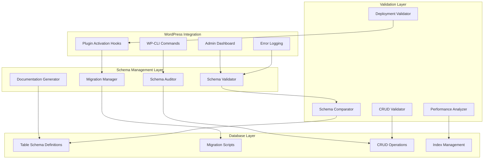

# Design Document

## Overview

The Database Schema Validation System is a comprehensive solution for ensuring consistency between SQL table schemas and CRUD operations in the vCard WordPress plugin. The system addresses the critical issue where temporary fixes and ad-hoc alterations have created inconsistencies between table creation scripts and actual database operations, potentially causing plugin activation failures on fresh WordPress installations.

**Design Philosophy:**
- Automated schema validation and synchronization
- Zero-downtime migrations with data preservation
- Comprehensive audit trails and documentation
- Prevention of schema drift through continuous validation
- Clean separation of concerns with dedicated schema management classes

**Key Design Principles:**
- WordPress coding standards compliance
- Backward compatibility with existing data
- Atomic database operations with rollback capabilities
- Performance-optimized schema validation
- Comprehensive error handling and logging
- Automated testing integration

## Architecture

### System Architecture



### Database Schema Management Architecture

**Core Components:**
1. **Schema Definition Registry** - Centralized schema definitions
2. **Migration Engine** - Handles schema changes and data migrations
3. **Validation Engine** - Validates CRUD operations against schemas
4. **Audit System** - Tracks schema changes and inconsistencies
5. **Documentation System** - Auto-generates schema documentation

## Components and Interfaces

### 1. Schema Validator Class

**Primary Responsibilities:**
- Validate table schemas against CRUD operations
- Detect missing columns, incorrect data types, and unused columns
- Generate detailed validation reports
- Provide schema correction recommendations

**Key Methods:**
```php
class VCard_Schema_Validator {
    public function validate_all_schemas();
    public function validate_table_schema($table_name);
    public function compare_crud_operations($table_name);
    public function generate_validation_report();
    public function get_schema_recommendations();
}
```

### 2. Migration Manager Class

**Primary Responsibilities:**
- Handle database schema migrations
- Preserve existing data during schema changes
- Manage incremental schema updates
- Provide rollback capabilities

**Key Methods:**
```php
class VCard_Migration_Manager {
    public function run_migrations();
    public function create_migration($version, $changes);
    public function rollback_migration($version);
    public function get_migration_status();
    public function validate_migration_safety($migration);
}
```

### 3. Schema Auditor Class

**Primary Responsibilities:**
- Scan codebase for database operations
- Identify schema inconsistencies
- Track schema usage patterns
- Generate audit reports

**Key Methods:**
```php
class VCard_Schema_Auditor {
    public function audit_codebase();
    public function scan_crud_operations();
    public function identify_inconsistencies();
    public function generate_audit_report();
    public function track_schema_usage();
}
```

### 4. CRUD Validator Class

**Primary Responsibilities:**
- Validate INSERT, UPDATE, SELECT, DELETE operations
- Check column existence and data type compatibility
- Validate foreign key relationships
- Ensure index usage optimization

**Key Methods:**
```php
class VCard_CRUD_Validator {
    public function validate_insert_operation($table, $data);
    public function validate_update_operation($table, $data, $where);
    public function validate_select_operation($query);
    public function validate_foreign_keys($table);
    public function check_index_usage($query);
}
```

### 5. Deployment Validator Class

**Primary Responsibilities:**
- Validate fresh installation compatibility
- Test plugin activation on clean WordPress instances
- Verify complete schema creation
- Ensure no manual interventions required

**Key Methods:**
```php
class VCard_Deployment_Validator {
    public function validate_fresh_installation();
    public function test_plugin_activation();
    public function verify_schema_creation();
    public function run_deployment_tests();
    public function generate_deployment_report();
}
```

## Data Models

### Schema Definition Model
```php
class VCard_Schema_Definition {
    private $table_name;
    private $columns;
    private $indexes;
    private $foreign_keys;
    private $constraints;
    
    public function get_create_table_sql();
    public function get_column_definitions();
    public function get_index_definitions();
    public function validate_against_existing();
}
```

### Migration Model
```php
class VCard_Migration {
    private $version;
    private $description;
    private $up_sql;
    private $down_sql;
    private $dependencies;
    
    public function execute();
    public function rollback();
    public function validate();
    public function get_affected_tables();
}
```

### Validation Report Model
```php
class VCard_Validation_Report {
    private $table_validations;
    private $crud_validations;
    private $inconsistencies;
    private $recommendations;
    
    public function add_validation_result($result);
    public function get_summary();
    public function export_to_json();
    public function export_to_html();
}
```

### Current Schema Analysis

**Existing Tables:**
1. **wp_vcard_analytics** - Profile analytics and tracking
2. **wp_vcard_subscriptions** - Billing and subscription management  
3. **wp_vcard_saved_contacts** - End user saved business contacts

**Identified Issues from Temporary Fixes:**
1. **Missing contact_data column** in wp_vcard_saved_contacts (fixed by fix-database.php)
2. **Missing updated_at column** in wp_vcard_saved_contacts (fixed by fix-database.php)
3. **Inconsistent column definitions** between CREATE TABLE and CRUD operations
4. **Missing indexes** for performance optimization

**Required Schema Corrections:**
```sql
-- wp_vcard_saved_contacts table corrections
ALTER TABLE wp_vcard_saved_contacts 
ADD COLUMN contact_data longtext NOT NULL COMMENT 'JSON data containing contact information' AFTER profile_id,
ADD COLUMN updated_at datetime DEFAULT CURRENT_TIMESTAMP ON UPDATE CURRENT_TIMESTAMP COMMENT 'Last update timestamp';

-- Additional indexes for performance
CREATE INDEX idx_saved_contacts_user_created ON wp_vcard_saved_contacts (user_id, saved_at);
CREATE INDEX idx_saved_contacts_profile_created ON wp_vcard_saved_contacts (profile_id, saved_at);
```

## Error Handling

### Schema Validation Errors
- **Missing Column Error:** Provide ALTER TABLE statement to add missing column
- **Data Type Mismatch:** Suggest column modification with data preservation
- **Missing Index Error:** Generate CREATE INDEX statement for performance optimization
- **Foreign Key Violation:** Validate relationships and suggest corrections

### Migration Errors
- **Migration Failure:** Automatic rollback with detailed error logging
- **Data Loss Prevention:** Pre-migration data backup and validation
- **Dependency Conflicts:** Resolve migration order and dependencies
- **Timeout Handling:** Break large migrations into smaller chunks

### Deployment Errors
- **Fresh Installation Failure:** Detailed error reporting with specific table creation issues
- **Plugin Activation Error:** Rollback partial changes and provide clear error messages
- **Permission Issues:** Validate database permissions and provide guidance
- **WordPress Compatibility:** Check WordPress version compatibility and requirements

## Testing Strategy

### Schema Validation Testing
- **Unit Tests:** Test individual schema validation methods
- **Integration Tests:** Test complete schema validation workflow
- **Regression Tests:** Ensure existing functionality remains intact
- **Performance Tests:** Validate schema operations don't impact performance

### Migration Testing
- **Migration Tests:** Test all migration scripts with sample data
- **Rollback Tests:** Verify rollback functionality preserves data integrity
- **Data Preservation Tests:** Ensure no data loss during migrations
- **Concurrent Access Tests:** Test migration behavior with active database connections

### Deployment Testing
- **Fresh Installation Tests:** Automated tests on clean WordPress instances
- **Multi-Version Tests:** Test compatibility across WordPress versions
- **Database Engine Tests:** Test with MySQL, MariaDB variations
- **Performance Impact Tests:** Measure activation time and resource usage

### CRUD Operation Testing
- **Operation Validation Tests:** Test all INSERT, UPDATE, SELECT, DELETE operations
- **Data Type Tests:** Verify data type compatibility and conversion
- **Foreign Key Tests:** Test relationship integrity and cascade operations
- **Index Usage Tests:** Verify optimal query performance with proper indexes

## Implementation Phases

### Phase 1: Schema Audit and Analysis
- Implement Schema Auditor class
- Scan existing codebase for database operations
- Generate comprehensive audit report
- Identify all schema inconsistencies

### Phase 2: Schema Validation System
- Implement Schema Validator class
- Create CRUD Validator class
- Build validation reporting system
- Integrate with WordPress admin dashboard

### Phase 3: Migration Management
- Implement Migration Manager class
- Create migration scripts for identified issues
- Build rollback capabilities
- Test migration safety and data preservation

### Phase 4: Deployment Validation
- Implement Deployment Validator class
- Create automated fresh installation tests
- Build plugin activation validation
- Ensure zero-configuration deployment

### Phase 5: Documentation and Cleanup
- Generate automated schema documentation
- Remove temporary fix files
- Consolidate database operations into proper classes
- Optimize performance and add comprehensive logging

This design provides a robust foundation for ensuring database schema consistency and preventing deployment issues in the vCard WordPress plugin.