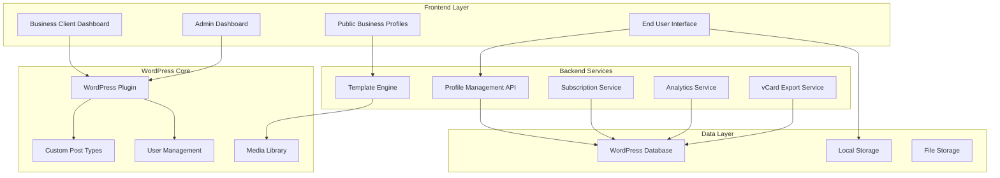

# Design Document

## Overview

The vCard Platform is a multi-tenant WordPress-based system that enables virtual business card exchange using existing vCard HTML templates. The platform serves three distinct user personas through a comprehensive web application with subscription billing, template customization, and contact management capabilities.

**Reference Sites Analyzed:**
- https://mywebcard.co.in/bhagawati-enterprises (Primary reference for comprehensive business sections)
- https://mywebcard.co.in  
- https://digivcard.io/instruction/card/

**Design Philosophy:**
The platform will function as a comprehensive "Google Business Portal" style directory, capturing all essential business information that potential leads need. The design prioritizes user experience with a focus on quick contact saving and immediate action-taking capabilities for end users visiting business profiles.

**Key Design Principles:**
- **User-Centric UX:** Quick contact saving and action-oriented interface design
- **Modern Visual Design:** Sleek, clean interface using Tailwind CSS for better performance and maintainability
- **Progressive Enhancement:** Strategic migration from Bootstrap to Tailwind while maintaining functionality
- **Mobile-First Approach:** Touch-optimized interactions with prominent action buttons
- **Efficient Navigation:** Anchor links for section jumping and scroll-to-top functionality
- **Visual Hierarchy:** Improved typography and spacing for better readability
- **Template Integration:** Existing vCard HTML templates enhanced with modern UX patterns
- **Multi-tenant Architecture:** Role-based access with WordPress plugin integration
- **Standards Compliance:** vCard export functionality with modern sharing capabilities

## Architecture

### System Architecture



### Database Schema

**WordPress Post-Based Architecture (Existing):**
- Custom Post Type: `vcard_profile` (already implemented)
- WordPress Post Meta for profile data (using `_vcard_` prefix)
- WordPress Media Library for image management
- WordPress Users table for authentication

**Extended Post Meta Fields:**
- Existing: `_vcard_first_name`, `_vcard_last_name`, `_vcard_company`, `_vcard_job_title`, `_vcard_phone`, `_vcard_email`, `_vcard_website`, `_vcard_address`, `_vcard_city`, `_vcard_state`, `_vcard_zip_code`, `_vcard_country`
- New Business Fields: `_vcard_business_name`, `_vcard_business_description`, `_vcard_services`, `_vcard_products`, `_vcard_gallery`, `_vcard_social_media`, `_vcard_business_hours`, `_vcard_template_config`

**Minimal Custom Tables (Only for specialized data):**
- `wp_vcard_analytics` - Visit tracking and statistics (performance-critical data)
- `wp_vcard_subscriptions` - Billing and subscription management
- `wp_vcard_saved_contacts` - End user saved business contacts (for registered users)

**WordPress Integration:**
- Custom User Roles: `vcard_client`, `vcard_user`
- Extended capabilities for multi-tenant access control
- WordPress REST API integration for frontend interactions

## Components and Interfaces

### 1. WordPress Plugin Core

**Main Plugin File Structure:**
```
vcard/
├── vcard.php (Main plugin file)
├── admin/
│   ├── admin-dashboard.php
│   └── business-client-dashboard.php
├── templates/
└── assets/
    ├── css/
    ├── js/
    └── images/
```

### 2. Template Integration System

**vCard Template Integration:**
The system will integrate with existing vCard HTML templates by:

1. **Template Structure Analysis:**
   - Parse existing template HTML structure
   - Identify data placeholders and sections
   - Map business profile fields to template elements

2. **Dynamic Data Binding:**
   - Replace static content with dynamic business data
   - Maintain template styling and layout integrity
   - Ensure responsive behavior across all templates

3. **Template Customization Engine:**
   - Allow color scheme modifications
   - Enable font and typography changes
   - Provide layout customization options
   - Maintain template design consistency

**Available Templates:**
- **CEO Template** - Executive and corporate professionals
- **Freelancer Template** - Independent contractors and consultants
- **Restaurant Template** - Food service businesses
- **Construction Template** - Construction and contracting services
- **Education Template** - Educational institutions and tutors
- **Fitness Template** - Gyms, trainers, and fitness professionals
- **Coffeebar Template** - Cafes and coffee shops
- **Handyman Template** - Home repair and maintenance services
- **Healthcare Template** - Medical professionals and clinics
- **Immigration Template** - Immigration and legal services
- **Lawyer Template** - Legal professionals
- **Makeup Artist Template** - Beauty and cosmetic services
- **NGO Template** - Non-profit organizations
- **Saloon Template** - Hair and beauty salons
- **Tour Template** - Travel and tourism services

### 3. Business Client Dashboard

**Profile Management Interface:**
- Multi-step profile creation wizard with template selection
- Template preview with live data integration
- Content management sections:
  - Basic Information (name, title, company, contact)
  - Services & Products with descriptions and pricing
  - Image Gallery with drag-and-drop upload
  - Social Media Links
  - Custom messaging/contact form
- Real-time preview functionality with selected template
- SEO optimization fields

**Template Customization Tools:**
- **Template Selector** - Visual grid of available templates with previews
- **Color Customization** - Primary and secondary color selection
- **Typography Options** - Font family and size adjustments
- **Layout Modifications** - Section visibility and ordering
- **Brand Integration** - Logo placement and sizing options
- **Mobile Preview** - See how template looks on mobile devices

### 4. vCard Export and Sharing System

**vCard Generation Engine:**
```javascript
// vCard 4.0 Standard Implementation
class VCardGenerator {
  generateVCard(profileData) {
    return `BEGIN:VCARD
VERSION:4.0
FN:${profileData.business_name}
ORG:${profileData.business_name}
TITLE:${profileData.owner_title}
TEL;TYPE=work,voice:${profileData.contact.primary_phone}
TEL;TYPE=work,cell:${profileData.contact.whatsapp}
EMAIL;TYPE=work:${profileData.contact.email}
URL:${profileData.contact.website}
ADR;TYPE=work:;;${profileData.contact.address.street};${profileData.contact.address.city};${profileData.contact.address.state};${profileData.contact.address.zip};${profileData.contact.address.country}
NOTE:${profileData.business_description}
PHOTO:${profileData.business_logo}
X-SOCIALPROFILE;TYPE=facebook:${profileData.social_media.facebook}
X-SOCIALPROFILE;TYPE=linkedin:${profileData.social_media.linkedin}
X-SOCIALPROFILE;TYPE=twitter:${profileData.social_media.twitter}
X-SOCIALPROFILE;TYPE=instagram:${profileData.social_media.instagram}
END:VCARD`;
  }
}
```

**Sharing Hub Features:**
- **QR Code Generator** - Customizable QR codes with logo embedding
- **Social Media Sharing** - WhatsApp, LinkedIn, Facebook, Twitter integration
- **Contact File Export** - VCF, vCard, and CSV formats
- **URL Sharing** - Custom short URLs with tracking
- **NFC Integration** - NFC tag programming data
- **Bulk Export** - Multiple contact export functionality

### 5. Modern End User Interface Design

**Enhanced Profile Display:**
```html
<!-- Top Action Bar - Always Visible -->
<div class="sticky top-0 bg-white shadow-sm border-b z-50">
  <div class="flex items-center justify-between p-4">
    <!-- Contact Save Status -->
    <div class="flex items-center space-x-2">
      <button id="save-contact" class="flex items-center space-x-1 px-3 py-1 rounded-full border">
        <svg class="w-4 h-4" id="save-icon"><!-- Save/Saved Icon --></svg>
        <span id="save-text">Save Contact</span>
      </button>
    </div>
    
    <!-- Quick Actions -->
    <div class="flex items-center space-x-2">
      <button class="p-2 rounded-full bg-green-500 text-white" title="Call">
        <svg class="w-4 h-4"><!-- Phone Icon --></svg>
      </button>
      <button class="p-2 rounded-full bg-blue-500 text-white" title="Message">
        <svg class="w-4 h-4"><!-- Message Icon --></svg>
      </button>
      <button class="p-2 rounded-full bg-green-600 text-white" title="WhatsApp">
        <svg class="w-4 h-4"><!-- WhatsApp Icon --></svg>
      </button>
      <button class="p-2 rounded-full bg-gray-500 text-white" title="Share">
        <svg class="w-4 h-4"><!-- Share Icon --></svg>
      </button>
      <button class="p-2 rounded-full bg-red-500 text-white" title="Directions">
        <svg class="w-4 h-4"><!-- Map Icon --></svg>
      </button>
    </div>
  </div>
  
  <!-- Section Navigation -->
  <div class="flex overflow-x-auto px-4 pb-2 space-x-4">
    <a href="#about" class="text-sm text-gray-600 hover:text-blue-600 whitespace-nowrap">About</a>
    <a href="#services" class="text-sm text-gray-600 hover:text-blue-600 whitespace-nowrap">Services</a>
    <a href="#products" class="text-sm text-gray-600 hover:text-blue-600 whitespace-nowrap">Products</a>
    <a href="#reviews" class="text-sm text-gray-600 hover:text-blue-600 whitespace-nowrap">Reviews</a>
    <a href="#gallery" class="text-sm text-gray-600 hover:text-blue-600 whitespace-nowrap">Gallery</a>
    <a href="#contact" class="text-sm text-gray-600 hover:text-blue-600 whitespace-nowrap">Contact</a>
  </div>
</div>

<!-- Scroll to Top Button -->
<button id="scroll-to-top" class="fixed bottom-6 right-6 p-3 bg-blue-600 text-white rounded-full shadow-lg hidden">
  <svg class="w-5 h-5"><!-- Up Arrow Icon --></svg>
</button>
```

**Progressive UI Enhancement Strategy:**
1. **Phase 1: UX Flow Optimization** - Improve user experience while maintaining Bootstrap
2. **Phase 2: Visual Refinement** - Optimize typography, spacing, and button sizes
3. **Phase 3: Tailwind Migration** - Replace Bootstrap with Tailwind CSS for modern design

**Contact Management:**
- Enhanced local storage implementation with visual feedback
- Streamlined account creation with social login
- Cloud sync for registered users with offline capability
- One-click vCard export functionality
- Contact organization with tags, notes, and quick actions

### 6. Enhanced Template-Based Profile Display

**Modern UX Integration Layer:**
Each business profile will maintain the selected vCard template design while adding a modern UX layer:

```html
<!-- Modern UX Overlay on Existing Templates -->
<div class="vcard-modern-wrapper">
  <!-- Sticky Action Bar (New) -->
  <div class="vcard-action-bar sticky-top">
    <!-- Save status and quick actions as defined above -->
  </div>
  
  <!-- Original Template Content (Enhanced) -->
  <div class="vcard-template-content">
    <!-- Existing template HTML with enhanced styling -->
  </div>
  
  <!-- Navigation Enhancements (New) -->
  <div class="vcard-navigation-enhancements">
    <!-- Scroll to top button and smooth scrolling -->
  </div>
</div>
```

**Template Enhancement Strategy:**

1. **Bootstrap to Tailwind Migration:**
   - **Phase 1:** Overlay Tailwind utilities on existing Bootstrap templates
   - **Phase 2:** Gradually replace Bootstrap components with Tailwind equivalents
   - **Phase 3:** Complete migration with performance optimization

2. **Visual Improvements:**
   - **Typography:** Smaller, more refined font sizes with better line spacing
   - **Buttons:** Sleeker, smaller buttons with better hover states
   - **Spacing:** Improved padding and margins for cleaner layout
   - **Colors:** Modern color palette with better contrast ratios

3. **UX Enhancements:**
   - **Quick Actions:** Always-accessible action buttons at the top
   - **Save Status:** Visual indicator for contact save state
   - **Section Navigation:** Anchor links for quick section jumping
   - **Smooth Scrolling:** Enhanced navigation between sections
   - **Mobile Optimization:** Touch-friendly interactions and sizing

**Template Customization Options:**
- **Modern Color Schemes** - Curated Tailwind-based color palettes
- **Typography Systems** - Tailwind typography scales for consistency
- **Component Variants** - Modern button, card, and form styles
- **Layout Flexibility** - CSS Grid and Flexbox-based responsive layouts
- **Performance Optimization** - Smaller CSS bundle with Tailwind's purging

## Data Models

### Comprehensive Business Profile Model
```javascript
{
  id: "unique_profile_id",
  user_id: "wordpress_user_id",
  
  // Template Configuration
  template: {
    name: "ceo|freelancer|restaurant|construction|education|fitness|coffeebar|handyman|healthcare|immigration|lawyer|makeup-artist|ngo|saloon|tour",
    customizations: {
      primary_color: "string",
      secondary_color: "string",
      font_family: "string",
      layout_options: "json"
    }
  },
  
  // Basic Business Information
  business_name: "string",
  business_tagline: "string",
  owner_name: "string",
  owner_title: "string",
  business_description: "text",
  business_logo: "string",
  cover_image: "string",
  
  // Contact Information (vCard Standard Fields)
  contact: {
    primary_phone: "string",
    secondary_phone: "string",
    whatsapp: "string",
    email: "string",
    website: "string",
    address: {
      street: "string",
      city: "string",
      state: "string",
      zip: "string",
      country: "string",
      latitude: "decimal",
      longitude: "decimal"
    }
  },
  
  // Business Hours
  business_hours: {
    monday: { open: "time", close: "time", closed: "boolean" },
    tuesday: { open: "time", close: "time", closed: "boolean" },
    wednesday: { open: "time", close: "time", closed: "boolean" },
    thursday: { open: "time", close: "time", closed: "boolean" },
    friday: { open: "time", close: "time", closed: "boolean" },
    saturday: { open: "time", close: "time", closed: "boolean" },
    sunday: { open: "time", close: "time", closed: "boolean" }
  },
  
  // Social Media (vCard Extended Fields)
  social_media: {
    facebook: "string",
    instagram: "string",
    linkedin: "string",
    twitter: "string",
    youtube: "string",
    tiktok: "string"
  },
  
  // Services
  services: [
    {
      id: "string",
      name: "string",
      description: "text",
      price: "decimal",
      category: "string",
      image: "string"
    }
  ],
  
  // Products
  products: [
    {
      id: "string",
      name: "string",
      description: "text",
      price: "decimal",
      category: "string",
      images: ["array_of_urls"],
      in_stock: "boolean"
    }
  ],
  
  // Gallery
  gallery: [
    {
      id: "string",
      image_url: "string",
      thumbnail_url: "string",
      title: "string",
      category: "string",
      order: "integer"
    }
  ],
  
  // vCard Export Configuration
  vcard_config: {
    include_logo: "boolean",
    include_social_media: "boolean",
    include_services: "boolean",
    export_format: "vcf|vcard|csv",
    custom_fields: "json"
  },
  
  // Analytics
  analytics: {
    profile_views: "integer",
    vcard_downloads: "integer",
    qr_scans: "integer",
    shares: "integer"
  },
  
  // Subscription
  subscription: {
    plan: "free|basic|professional",
    status: "active|expired|cancelled",
    expires_at: "datetime",
    created_at: "datetime",
    updated_at: "datetime"
  }
}
```

## Error Handling

### Template Integration Errors
- **Template Not Found:** Fallback to default template
- **Template Parsing Error:** Log error and use basic layout
- **Asset Loading Failure:** Graceful degradation with fallback styles
- **Data Binding Error:** Display placeholder content with error logging

### vCard Export Errors
- **Invalid Data:** Validate and sanitize before export
- **Format Conversion Error:** Provide alternative export formats
- **File Generation Failure:** Retry mechanism with error notification
- **Download Error:** Alternative download methods (email, cloud storage)

### Subscription and Billing Errors
- **Payment Processing Failure:** Retry mechanism with user notification
- **Subscription Expiry:** Grace period with profile deactivation warning
- **Billing Integration Error:** Manual billing fallback with admin notification

## UX Enhancement and Migration Strategy

### Phase 1: UX Flow Optimization (Bootstrap Foundation)
**Objective:** Improve user experience while maintaining existing Bootstrap framework

**Key Improvements:**
- Add sticky action bar with save status and quick action buttons
- Implement section navigation with anchor links
- Add scroll-to-top functionality
- Optimize button sizes and spacing within Bootstrap constraints
- Improve typography hierarchy with better font sizes

**Implementation Approach:**
```css
/* Enhanced Bootstrap Overrides */
.vcard-action-bar {
  position: sticky;
  top: 0;
  z-index: 1050;
  background: white;
  border-bottom: 1px solid #dee2e6;
  padding: 1rem;
}

.btn-modern {
  padding: 0.5rem 1rem;
  font-size: 0.875rem;
  border-radius: 0.5rem;
}

.section-nav {
  display: flex;
  gap: 1rem;
  overflow-x: auto;
  padding: 0.5rem 1rem;
}
```

### Phase 2: Component-by-Component Tailwind Migration - Action Bar Components
**Objective:** Migrate specific components from Bootstrap to Tailwind without running both frameworks simultaneously

**Key Improvements:**
- Set up Tailwind CSS build process and configuration
- Migrate sticky action bar components (buttons, layout, positioning) from Bootstrap to Tailwind
- Replace Bootstrap button classes with Tailwind equivalents for save status and quick actions
- Remove Bootstrap dependencies only for migrated components

**Implementation Approach:**
```css
/* Replace Bootstrap action bar with Tailwind */
/* Before (Bootstrap): */
.action-bar .btn-primary { ... }
.action-bar .btn-outline-secondary { ... }

/* After (Tailwind): */
@layer components {
  .vcard-action-btn {
    @apply p-2 rounded-full text-white shadow-lg hover:shadow-xl transition-shadow;
  }
  
  .vcard-save-btn {
    @apply flex items-center space-x-1 px-3 py-1 rounded-full border transition-colors;
  }
}
```

### Phase 3: Component-by-Component Migration - Navigation and Forms
**Objective:** Continue migrating components systematically without framework conflicts

**Key Improvements:**
- Migrate section navigation anchor links from Bootstrap to Tailwind
- Replace Bootstrap form components with Tailwind-styled alternatives
- Convert Bootstrap cards and containers to Tailwind equivalents
- Remove Bootstrap dependencies for migrated navigation and form components

**Implementation Approach:**
```css
/* Replace Bootstrap navigation with Tailwind */
/* Before (Bootstrap): */
.nav-pills .nav-link { ... }
.card { ... }

/* After (Tailwind): */
@layer components {
  .vcard-section-nav {
    @apply flex overflow-x-auto px-4 pb-2 space-x-4 scrollbar-hide;
  }
  
  .vcard-nav-link {
    @apply text-sm text-gray-600 hover:text-blue-600 whitespace-nowrap transition-colors;
  }
}
```

### Phase 4: Complete Template Migration and Optimization
**Objective:** Complete the migration by replacing all remaining Bootstrap components

**Key Improvements:**
- Migrate remaining Bootstrap grid system to Tailwind CSS Grid/Flexbox
- Replace all remaining Bootstrap utility classes with Tailwind equivalents
- Remove Bootstrap dependency entirely
- Optimize CSS bundle size using Tailwind's purging capabilities
- Validate all functionality remains intact

**Implementation Approach:**
```css
/* Final migration - remove all Bootstrap dependencies */
/* Before (Bootstrap): */
.container-fluid { ... }
.row { ... }
.col-md-6 { ... }

/* After (Tailwind): */
@layer components {
  .vcard-container {
    @apply w-full px-4 mx-auto;
  }
  
  .vcard-grid {
    @apply grid grid-cols-1 md:grid-cols-2 gap-6;
  }
}
```

### User Experience Enhancements

**Contact Save Status Indicator:**
```javascript
class ContactSaveManager {
  constructor() {
    this.isContactSaved = this.checkSaveStatus();
    this.updateSaveIndicator();
  }
  
  updateSaveIndicator() {
    const saveBtn = document.getElementById('save-contact');
    const saveIcon = document.getElementById('save-icon');
    const saveText = document.getElementById('save-text');
    
    if (this.isContactSaved) {
      saveBtn.classList.add('bg-green-100', 'border-green-300', 'text-green-700');
      saveIcon.innerHTML = '<!-- Checkmark SVG -->';
      saveText.textContent = 'Saved';
    } else {
      saveBtn.classList.add('bg-gray-50', 'border-gray-300', 'text-gray-700');
      saveIcon.innerHTML = '<!-- Plus SVG -->';
      saveText.textContent = 'Save Contact';
    }
  }
}
```

**Quick Action Handlers:**
```javascript
class QuickActions {
  constructor(businessData) {
    this.business = businessData;
    this.initializeActions();
  }
  
  initializeActions() {
    // Phone call action
    document.querySelector('[title="Call"]').onclick = () => {
      window.location.href = `tel:${this.business.phone}`;
    };
    
    // WhatsApp action
    document.querySelector('[title="WhatsApp"]').onclick = () => {
      const message = `Hi, I found your business profile and would like to connect.`;
      window.open(`https://wa.me/${this.business.whatsapp}?text=${encodeURIComponent(message)}`);
    };
    
    // Directions action
    document.querySelector('[title="Directions"]').onclick = () => {
      const address = encodeURIComponent(this.business.address);
      window.open(`https://maps.google.com/?q=${address}`);
    };
  }
}
```

**Smooth Section Navigation:**
```javascript
class SectionNavigation {
  constructor() {
    this.initializeSmoothScrolling();
    this.initializeScrollToTop();
  }
  
  initializeSmoothScrolling() {
    document.querySelectorAll('a[href^="#"]').forEach(anchor => {
      anchor.addEventListener('click', (e) => {
        e.preventDefault();
        const target = document.querySelector(anchor.getAttribute('href'));
        target.scrollIntoView({ behavior: 'smooth', block: 'start' });
      });
    });
  }
  
  initializeScrollToTop() {
    const scrollBtn = document.getElementById('scroll-to-top');
    
    window.addEventListener('scroll', () => {
      if (window.pageYOffset > 300) {
        scrollBtn.classList.remove('hidden');
      } else {
        scrollBtn.classList.add('hidden');
      }
    });
    
    scrollBtn.onclick = () => {
      window.scrollTo({ top: 0, behavior: 'smooth' });
    };
  }
}
```

## Testing Strategy

### Template Integration Testing
- **Template Rendering Tests:** Verify all templates render correctly with sample data
- **Responsive Design Tests:** Test all templates across device sizes
- **Customization Tests:** Verify color and font changes apply correctly
- **Data Binding Tests:** Ensure business data populates template fields correctly

### vCard Export Testing
- **Format Compliance Tests:** Validate vCard files against standards
- **Import Compatibility Tests:** Test imports in major contact management systems
- **Bulk Export Tests:** Verify multiple contact exports work correctly
- **Data Integrity Tests:** Ensure all business information is preserved in exports

### Cross-Browser and Device Testing
- **Browser Compatibility:** Test across Chrome, Firefox, Safari, Edge
- **Mobile Device Testing:** iOS and Android device testing
- **Template Responsiveness:** Verify all templates work on mobile devices
- **Performance Testing:** Load time optimization for template rendering

### Integration Testing
- **WordPress Plugin Integration:** Test plugin activation, deactivation, updates
- **Payment Gateway Integration:** Test subscription flows and billing
- **Social Media Integration:** Verify sharing functionality across platforms
- **Analytics Integration:** Test tracking and reporting functionality

This design document provides a comprehensive foundation for building a vCard platform that leverages existing HTML templates while providing modern functionality for business networking and contact management.