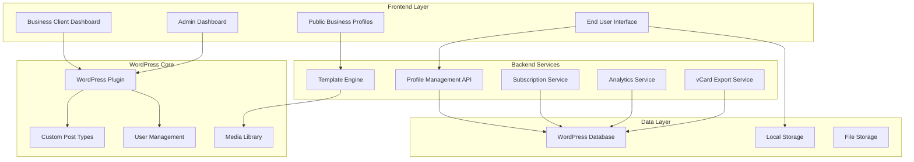

# Design Document

## Overview

The vCard Platform is a multi-tenant WordPress-based system that enables virtual business card exchange using existing vCard HTML templates. The platform serves three distinct user personas through a comprehensive web application with subscription billing, template customization, and contact management capabilities.

**Reference Sites Analyzed:**
- https://mywebcard.co.in/bhagawati-enterprises (Primary reference for comprehensive business sections)
- https://mywebcard.co.in  
- https://digivcard.io/instruction/card/

**Design Philosophy:**
The platform will function as a comprehensive "Google Business Portal" style directory, capturing all essential business information that potential leads need. The existing vCard HTML templates will serve as the foundation for profile layouts, with business data integrated into these professional designs.

**Key Design Principles:**
- Google Business Portal inspired comprehensive sections
- Integration with existing vCard HTML templates for professional layouts
- Mobile-first responsive design with progressive web app capabilities
- Template-based customization system with existing design patterns
- Multi-tenant architecture with role-based access
- WordPress plugin integration for seamless administration
- Local storage with optional cloud sync for end users
- Standards-compliant vCard export functionality

## Architecture

### System Architecture



### Database Schema

**WordPress Custom Tables:**
- `wp_vcard_profiles` - Core business profile data
- `wp_vcard_templates` - Template assignments and customizations
- `wp_vcard_analytics` - Visit tracking and statistics
- `wp_vcard_subscriptions` - Billing and subscription management
- `wp_vcard_saved_contacts` - End user saved business contacts (for registered users)

**WordPress Integration:**
- Custom Post Type: `vcard_profile`
- Custom User Roles: `vcard_client`, `vcard_user`
- Custom Meta Fields for profile data
- WordPress Media Library for image management

## Components and Interfaces

### 1. WordPress Plugin Core

**Main Plugin File Structure:**
```
vcard/
├── vcard.php (Main plugin file)
├── includes/
│   ├── class-business-profile.php
│   ├── class-template-engine.php
│   ├── class-subscription-manager.php
│   ├── class-analytics.php
│   └── class-vcard-export.php
├── admin/
│   ├── admin-dashboard.php
│   └── business-client-dashboard.php
├── public/
│   ├── profile-display.php
│   └── end-user-interface.php
├── templates/
│   ├── ceo/
│   ├── freelancer/
│   ├── restaurant/
│   ├── construction/
│   ├── education/
│   ├── fitness/
│   ├── coffeebar/
│   ├── handyman/
│   ├── healthcare/
│   ├── immigration/
│   ├── lawyer/
│   ├── makeup-artist/
│   ├── ngo/
│   ├── saloon/
│   └── tour/
└── assets/
    ├── css/
    ├── js/
    └── images/
```

### 2. Template Integration System

**vCard Template Integration:**
The system will integrate with existing vCard HTML templates by:

1. **Template Structure Analysis:**
   - Parse existing template HTML structure
   - Identify data placeholders and sections
   - Map business profile fields to template elements

2. **Dynamic Data Binding:**
   - Replace static content with dynamic business data
   - Maintain template styling and layout integrity
   - Ensure responsive behavior across all templates

3. **Template Customization Engine:**
   - Allow color scheme modifications
   - Enable font and typography changes
   - Provide layout customization options
   - Maintain template design consistency

**Available Templates:**
- **CEO Template** - Executive and corporate professionals
- **Freelancer Template** - Independent contractors and consultants
- **Restaurant Template** - Food service businesses
- **Construction Template** - Construction and contracting services
- **Education Template** - Educational institutions and tutors
- **Fitness Template** - Gyms, trainers, and fitness professionals
- **Coffeebar Template** - Cafes and coffee shops
- **Handyman Template** - Home repair and maintenance services
- **Healthcare Template** - Medical professionals and clinics
- **Immigration Template** - Immigration and legal services
- **Lawyer Template** - Legal professionals
- **Makeup Artist Template** - Beauty and cosmetic services
- **NGO Template** - Non-profit organizations
- **Saloon Template** - Hair and beauty salons
- **Tour Template** - Travel and tourism services

### 3. Business Client Dashboard

**Profile Management Interface:**
- Multi-step profile creation wizard with template selection
- Template preview with live data integration
- Content management sections:
  - Basic Information (name, title, company, contact)
  - Services & Products with descriptions and pricing
  - Image Gallery with drag-and-drop upload
  - Social Media Links
  - Custom messaging/contact form
- Real-time preview functionality with selected template
- SEO optimization fields

**Template Customization Tools:**
- **Template Selector** - Visual grid of available templates with previews
- **Color Customization** - Primary and secondary color selection
- **Typography Options** - Font family and size adjustments
- **Layout Modifications** - Section visibility and ordering
- **Brand Integration** - Logo placement and sizing options
- **Mobile Preview** - See how template looks on mobile devices

### 4. vCard Export and Sharing System

**vCard Generation Engine:**
```javascript
// vCard 4.0 Standard Implementation
class VCardGenerator {
  generateVCard(profileData) {
    return `BEGIN:VCARD
VERSION:4.0
FN:${profileData.business_name}
ORG:${profileData.business_name}
TITLE:${profileData.owner_title}
TEL;TYPE=work,voice:${profileData.contact.primary_phone}
TEL;TYPE=work,cell:${profileData.contact.whatsapp}
EMAIL;TYPE=work:${profileData.contact.email}
URL:${profileData.contact.website}
ADR;TYPE=work:;;${profileData.contact.address.street};${profileData.contact.address.city};${profileData.contact.address.state};${profileData.contact.address.zip};${profileData.contact.address.country}
NOTE:${profileData.business_description}
PHOTO:${profileData.business_logo}
X-SOCIALPROFILE;TYPE=facebook:${profileData.social_media.facebook}
X-SOCIALPROFILE;TYPE=linkedin:${profileData.social_media.linkedin}
X-SOCIALPROFILE;TYPE=twitter:${profileData.social_media.twitter}
X-SOCIALPROFILE;TYPE=instagram:${profileData.social_media.instagram}
END:VCARD`;
  }
}
```

**Sharing Hub Features:**
- **QR Code Generator** - Customizable QR codes with logo embedding
- **Social Media Sharing** - WhatsApp, LinkedIn, Facebook, Twitter integration
- **Contact File Export** - VCF, vCard, and CSV formats
- **URL Sharing** - Custom short URLs with tracking
- **NFC Integration** - NFC tag programming data
- **Bulk Export** - Multiple contact export functionality

### 5. End User Interface

**Profile Discovery:**
- Public directory with template-based profile displays
- Search and filtering by industry/template type
- Location-based filtering
- Featured/promoted business listings

**Contact Management:**
- Local storage implementation for anonymous users
- Optional account creation with social login
- Cloud sync for registered users
- vCard export functionality
- Contact organization with tags and notes

### 6. Template-Based Profile Display

**Dynamic Template Rendering:**
Each business profile will be rendered using the selected vCard template with the following integration:

1. **Header Section Integration:**
   - Business name → Template title area
   - Business logo → Template logo placeholder
   - Contact info → Template contact section
   - Social media → Template social links

2. **Content Section Mapping:**
   - Business description → Template about section
   - Services → Template services/portfolio section
   - Products → Template products/offerings section
   - Gallery → Template gallery/portfolio section
   - Reviews → Template testimonials section

3. **Contact Form Integration:**
   - Template contact form → Dynamic inquiry form
   - Contact information → Template contact details
   - Location → Template map integration
   - Business hours → Template schedule section

**Template Customization Options:**
- **Color Schemes** - Modify template colors while maintaining design integrity
- **Typography** - Adjust fonts within template design constraints
- **Section Visibility** - Show/hide template sections based on business needs
- **Layout Variations** - Minor layout adjustments within template framework
- **Brand Integration** - Logo and brand color integration

## Data Models

### Comprehensive Business Profile Model
```javascript
{
  id: "unique_profile_id",
  user_id: "wordpress_user_id",
  
  // Template Configuration
  template: {
    name: "ceo|freelancer|restaurant|construction|education|fitness|coffeebar|handyman|healthcare|immigration|lawyer|makeup-artist|ngo|saloon|tour",
    customizations: {
      primary_color: "string",
      secondary_color: "string",
      font_family: "string",
      layout_options: "json"
    }
  },
  
  // Basic Business Information
  business_name: "string",
  business_tagline: "string",
  owner_name: "string",
  owner_title: "string",
  business_description: "text",
  business_logo: "string",
  cover_image: "string",
  
  // Contact Information (vCard Standard Fields)
  contact: {
    primary_phone: "string",
    secondary_phone: "string",
    whatsapp: "string",
    email: "string",
    website: "string",
    address: {
      street: "string",
      city: "string",
      state: "string",
      zip: "string",
      country: "string",
      latitude: "decimal",
      longitude: "decimal"
    }
  },
  
  // Business Hours
  business_hours: {
    monday: { open: "time", close: "time", closed: "boolean" },
    tuesday: { open: "time", close: "time", closed: "boolean" },
    wednesday: { open: "time", close: "time", closed: "boolean" },
    thursday: { open: "time", close: "time", closed: "boolean" },
    friday: { open: "time", close: "time", closed: "boolean" },
    saturday: { open: "time", close: "time", closed: "boolean" },
    sunday: { open: "time", close: "time", closed: "boolean" }
  },
  
  // Social Media (vCard Extended Fields)
  social_media: {
    facebook: "string",
    instagram: "string",
    linkedin: "string",
    twitter: "string",
    youtube: "string",
    tiktok: "string"
  },
  
  // Services
  services: [
    {
      id: "string",
      name: "string",
      description: "text",
      price: "decimal",
      category: "string",
      image: "string"
    }
  ],
  
  // Products
  products: [
    {
      id: "string",
      name: "string",
      description: "text",
      price: "decimal",
      category: "string",
      images: ["array_of_urls"],
      in_stock: "boolean"
    }
  ],
  
  // Gallery
  gallery: [
    {
      id: "string",
      image_url: "string",
      thumbnail_url: "string",
      title: "string",
      category: "string",
      order: "integer"
    }
  ],
  
  // vCard Export Configuration
  vcard_config: {
    include_logo: "boolean",
    include_social_media: "boolean",
    include_services: "boolean",
    export_format: "vcf|vcard|csv",
    custom_fields: "json"
  },
  
  // Analytics
  analytics: {
    profile_views: "integer",
    vcard_downloads: "integer",
    qr_scans: "integer",
    shares: "integer"
  },
  
  // Subscription
  subscription: {
    plan: "free|basic|professional",
    status: "active|expired|cancelled",
    expires_at: "datetime",
    created_at: "datetime",
    updated_at: "datetime"
  }
}
```

## Error Handling

### Template Integration Errors
- **Template Not Found:** Fallback to default template
- **Template Parsing Error:** Log error and use basic layout
- **Asset Loading Failure:** Graceful degradation with fallback styles
- **Data Binding Error:** Display placeholder content with error logging

### vCard Export Errors
- **Invalid Data:** Validate and sanitize before export
- **Format Conversion Error:** Provide alternative export formats
- **File Generation Failure:** Retry mechanism with error notification
- **Download Error:** Alternative download methods (email, cloud storage)

### Subscription and Billing Errors
- **Payment Processing Failure:** Retry mechanism with user notification
- **Subscription Expiry:** Grace period with profile deactivation warning
- **Billing Integration Error:** Manual billing fallback with admin notification

## Testing Strategy

### Template Integration Testing
- **Template Rendering Tests:** Verify all templates render correctly with sample data
- **Responsive Design Tests:** Test all templates across device sizes
- **Customization Tests:** Verify color and font changes apply correctly
- **Data Binding Tests:** Ensure business data populates template fields correctly

### vCard Export Testing
- **Format Compliance Tests:** Validate vCard files against standards
- **Import Compatibility Tests:** Test imports in major contact management systems
- **Bulk Export Tests:** Verify multiple contact exports work correctly
- **Data Integrity Tests:** Ensure all business information is preserved in exports

### Cross-Browser and Device Testing
- **Browser Compatibility:** Test across Chrome, Firefox, Safari, Edge
- **Mobile Device Testing:** iOS and Android device testing
- **Template Responsiveness:** Verify all templates work on mobile devices
- **Performance Testing:** Load time optimization for template rendering

### Integration Testing
- **WordPress Plugin Integration:** Test plugin activation, deactivation, updates
- **Payment Gateway Integration:** Test subscription flows and billing
- **Social Media Integration:** Verify sharing functionality across platforms
- **Analytics Integration:** Test tracking and reporting functionality

This design document provides a comprehensive foundation for building a vCard platform that leverages existing HTML templates while providing modern functionality for business networking and contact management.